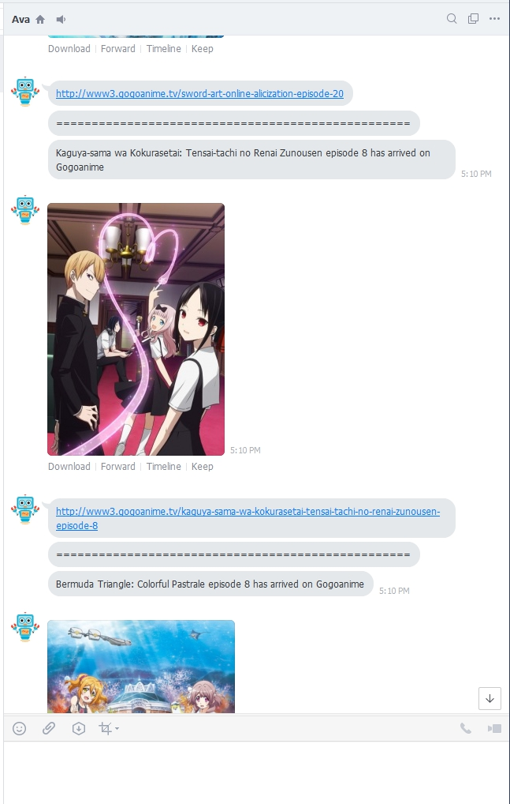

# AnimeBot

This bot extract data from gogoanime and alert if there are any new episodes.

After that, it would send those notification via LINE.

Subscription system is not supported yet (so only I can use it :P)

But feel free to fork and change the APP_ID to your ID and it would work normally.

## Screenshot

## TODO

1. Send notification to everyone that added alert bot.
2. Able to tell which anime user want to filter in/out by typing to the bot.
3. Add extraction from another sites, expanding episodes that can alert.

